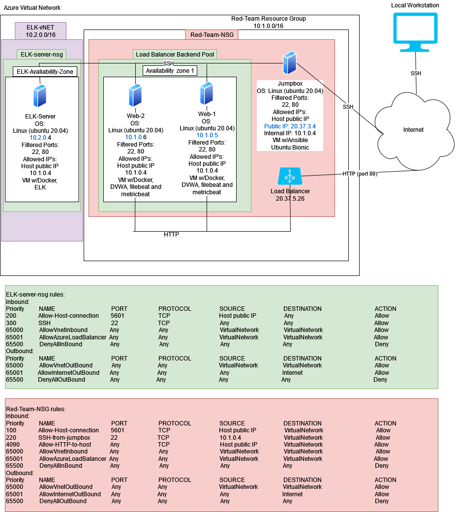
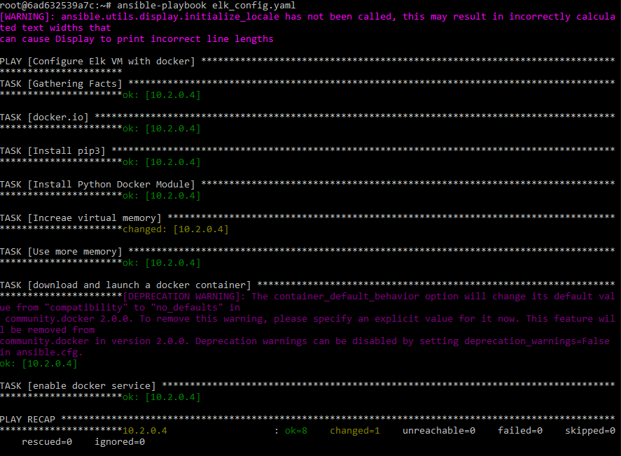

## Automated ELK Stack Deployment

The files in this repository were used to configure the network depicted below.

The following files have been tested and used to generate a live ELK deployment on Azure. They can be used to either recreate the entire deployment pictured above. Alternatively, select portions of the playbook file may be used to install only certain pieces of it, such as Filebeat. These files are: 

  - UWA-CYBER-ELK\Ansible\elk_config.yaml.txt
  - UWA-CYBER-ELK\Ansible\filebeat-playbook.yaml.txt
  - UWA-CYBER-ELK\Ansible\metricbeat-playbook.yml.txt
  - UWA-CYBER-ELK\Ansible\hosts.txt
  - UWA-CYBER-ELK\Ansible\filebeat-config.yaml.txt
  - UWA-CYBER-ELK\Ansible\metricbeat-config.yml.txt

This document contains the following details:
- Description of the Topology
- Access Policies
- ELK Configuration
  - Beats in Use
  - Machines Being Monitored
- How to Use the Ansible Build

### Description of the Topology

The main purpose of this network is to expose a load-balanced and monitored instance of DVWA, the D*mn Vulnerable Web Application.

Load balancing ensures that the application will be highly avaliable, in addition to restricting access to the network.
Load balancers work to direct traffic between multiple web servers in order to prevent a server from overloading from traffic.
A jump box allows a secure ssh connection from the host to the jump box to then be able to access the rest of the network easily from within the jumpbox, within the network.

Integrating an ELK server allows users to easily monitor the vulnerable VMs for changes to the logs and system metrics.
Filebeat monitors the system log files and collects log events which are sent to elasticsearch for indexing.
Metricbeat takes metrics and statistics from the oporating system then sends that data to elasticsearch.

The configuration details of each machine may be found below.

| Name                 | Function   | IP Address | Operating System     |
|----------------------|------------|------------|----------------------|
| Jump-Box-Provisioner | Gateway    | 10.1.0.4   | Linux (ubuntu 20.04) |
| Web-1                | Web Server | 10.1.0.5   | Linux (ubuntu 20.04) |
| Web-2                | Web Server | 10.1.0.6   | Linux (ubuntu 20.04) |
| ELK-server           | ELK Server | 10.2.0.4   | Linux (ubuntu 20.04) |

### Access Policies

The machines on the internal network are not exposed to the public Internet. 

Access to the web machines is only allowed from the following IP addresses:
- <your public ip address>
- 10.1.0.4

Machines within the network can only be accessed by the Jump-box machine.
- ELK-VM access through jump box machine IP: 10.1.0.4

A summary of the access policies in place can be found in the table below.

| Name                 | Publicly Accessible | Allowed IP Addresses        |
|----------------------|---------------------|-----------------------------|
| Jump-Box-Provisioner | NO                  | 14.203.252.229              |
| Web-1                | YES                 | 14.203.252.229 and 10.1.0.4 |
| Web-2                | YES                 | 14.203.252.229 and 10.1.0.4 |
| ELK-server           | NO                  | 10.1.0.4 and 14.203.252.229 |

### Elk Configuration

Ansible was used to automate configuration of the ELK machine. No configuration was performed manually, which is advantageous because...
- We can now configure all the web servers at the same time without having to do it all individually for each web server

The playbook implements the following tasks:
- Install Docker
- Install pip3
- Install Python Docker Module
- Increase and use more memory
- Download, Launch and enable the docker container at startup

The following screenshot displays the result of running the ELK playbook.

### Target Machines & Beats
This ELK server is configured to monitor the following machines:
- 10.1.0.5
- 10.1.0.6

We have installed the following Beats on these machines:
- Filebeat
- Metricbeat

These Beats allow us to collect the following information from each machine:
Filebeat collects log events from system logs which can track changes being made to crucial system files.
Metricbeat takes metrics from the oporating system which can track things such as system up time, etc.

### Using the Playbook
In order to use the playbook, you will need to have an Ansible control node already configured. Assuming you have such a control node provisioned: 

SSH into the control node and follow the steps below:
- Copy the filebeat-config.yaml and metricbeat-config.yml files to /etc/ansible and copy filebeat-playbook.yaml, elk_config.yaml and metricbeat-playbook.yml to the ansible docker container  .
- Update the hosts file to include 10.1.0.5 and 10.1.0.6 under webservers and 10.2.0.4 under elk.
- Run the playbook, and navigate to http://[your.ELKVM.IP]:5601/app/kibana. to check that the installation worked as expected.
